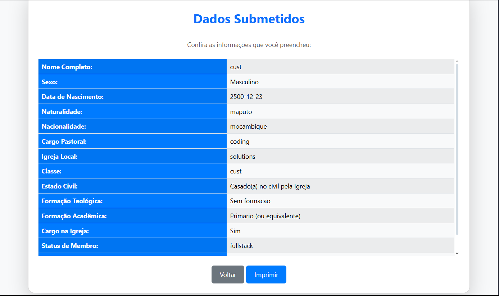

<<<<<<< HEAD
 
# 📊 Sistema de Levantamento de Dados


## 📌 Sobre o Projeto

O **Sistema de Levantamento de Dados** é uma aplicação web desenvolvida para **coletar, armazenar e analisar informações**.  

✅ **Tecnologias usadas:**  
- **Back-end:** PHP, MySQL  
- **Front-end:** HTML, CSS, JavaScript, Bootstrap  
- **Gerenciamento de Dependências:** Composer  
- **Configuração Segura:** Dotenv  

📸 **Demonstração:**  

### 📌 Tela de Maior  
.png)
### 📌 Tela de Media
.png)
### 📌 Tela de Menor
.png)

---

## 🚀 Objetivo do Projeto  

Este sistema foi criado para facilitar a **coleta e análise de dados**, permitindo a **geração de relatórios dinâmicos** e **visualizações interativas**.  

🔹 **Principais Recursos:**  
✅ Cadastro de usuários  
✅ Coleta de dados  
✅ Geração de relatórios gráficos  
✅ Exportação de informações  

---

## 👥 Equipe de Desenvolvimento

| Nome | Função | Contato |
|------|--------|---------|
| **Custódio Titosse** | Fullstack Developer | 📧 custodiotitossetitosse@email.com |
| **Jemisse Zeca** | Frontend Developer | 📧 jemissezeca07s3@email.com |

---

## ⚙️ Instalação

### ✅ **Pré-requisitos**
Antes de instalar, certifique-se de ter:  

- [PHP](https://www.php.net/downloads.php) (7.4 ou superior)  
- [MySQL](https://www.mysql.com/downloads/)  
- [Composer](https://getcomposer.org/download/)  
- [Node.js](https://nodejs.org/) *(se for usar npm/yarn para o frontend)*  
- Um servidor local como [XAMPP](https://www.apachefriends.org/pt_br/index.html) ou [Laragon](https://laragon.org/)  

### 📥 **Passo a Passo para Instalar**  


1️⃣ **Clone o repositório:** 

```bash
git clone https://github.com/seu-usuario/seu-repositorio.git
cd seu-repositorio
```

2️⃣ **Instale as dependências:**  
```bash
composer install
```

3️⃣ **Configure o arquivo `.env`**  
```ini
DB_HOST=localhost
DB_DATABASE=nome_do_banco
DB_USERNAME=root
DB_PASSWORD=
```

4️⃣ **Execute as migrações:**  
```bash
php artisan migrate
```

5️⃣ **Inicie o servidor local:**  
```bash
php -S localhost:8000
```

🔹 **Acesse:**  
**`http://localhost:8000`** no navegador.

---

## 🛠️ Como Usar  

1. **Cadastrar Usuários:** Acesse o painel e crie novos usuários.  
2. **Coletar Dados:** Insira informações na plataforma.  
3. **Gerar Relatórios:** Exporte tabelas e gráficos baseados nos dados coletados.  

 

---

## 📜 Licença  

Este projeto é licenciado sob a **MIT License**. Para mais detalhes, consulte o arquivo [LICENSE](LICENSE).  

---

## 🌱 Git Flow e Padrões de Contribuição  

Para contribuir, siga o fluxo **Git Flow**:  

1️⃣ **Branch `main`**: Versão estável  
2️⃣ **Branch `develop`**: Desenvolvimento contínuo  
3️⃣ **Feature Branch (`feature/nova-funcionalidade`)**: Para novas implementações  
4️⃣ **Hotfix Branch (`hotfix/correcao`)**: Para correções urgentes  

---

## 🌟 Como Contribuir  

1. **Faça um Fork** do projeto  
2. Crie uma **branch** para sua funcionalidade:  
   ```bash
   git checkout -b feature/minha-funcionalidade
   ```
3. Faça o commit das mudanças:  
   ```bash
   git commit -m "Adicionando nova funcionalidade"
   ```
4. Envie para o repositório remoto:  
   ```bash
   git push origin feature/minha-funcionalidade
   ```
5. **Abra um Pull Request** 🚀  

💡 Qualquer contribuição é bem-vinda!  

⭐ **Se gostou do projeto, não esqueça de dar uma estrela!** ⭐  


=======
# JMU-estatistica
🔍 JMU-Estatística – Repositório voltado para a coleta e organização de dados estatísticos. Contém scripts e ferramentas para obter dados de diversas fontes, prepará-los para análise e garantir a qualidade e consistência das informações coletadas.
>>>>>>> cf1471310429fdd18fae2144d810e2421d0d6c69
